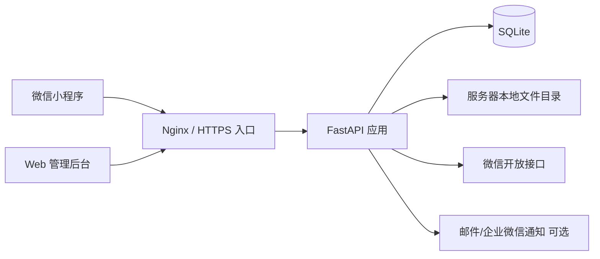
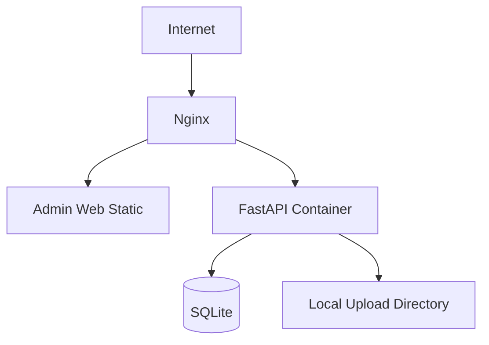

# 小程序 MVP 架构设计（Python 后端版）

版本：v0.1  
日期：2026-03-13

## 1. 文档目标

本文基于 [小程序MVP规划.md](D:\Codes\YRFasion\小程序MVP规划.md) 的产品范围，给出第一版可落地的系统架构设计。

目标是支撑以下一期能力：

- 微信小程序商品展示
- 商品详情留言/咨询
- 店主 Web 后台登录与商品管理
- 商品排序与上下架
- 留言查看、标记、回复
- 用户基础访问记录

一期明确不包含：

- 支付
- 购物车
- 订单系统
- 优惠券
- 复杂会员体系
- 多角色权限体系
- iPad 原生 App

## 2. 架构结论

第一版建议采用：

`微信小程序 + 响应式 Web 管理后台 + Python FastAPI 单体后端 + SQLite + 本地文件存储`

这是一个面向 MVP 的轻量单体架构，不追求过度拆分，重点是：

- 开发快
- 部署简单
- 后续能平滑扩展

## 3. 设计原则

### 3.1 范围收敛

第一版只解决展示、内容维护、留言处理三件事，不提前引入订单、支付、营销等复杂模型。

### 3.2 单体优先

一期不拆微服务。商品、用户、留言、后台账号都放在一个后端服务内，减少开发和运维成本。

### 3.3 媒体与业务解耦

一期图片可先落服务器本地目录，业务库只保存元数据和访问地址；同时在代码层保留统一文件存储抽象，方便后续迁移到对象存储。

### 3.4 后台优先可运营

留言提醒、商品排序、内容上下架这些运营能力优先做稳定，不把提醒逻辑放在用户侧小程序前台。

### 3.5 为二期预留扩展点

虽然一期不做订单和支付，但数据结构、接口分层和部署方式需要能支撑后续继续演进。

## 4. 总体架构



### 4.1 架构说明

- 微信小程序面向客户，负责商品浏览、详情查看、留言提交。
- Web 管理后台面向店主，负责商品管理、图片上传、留言处理、查看用户记录。
- FastAPI 作为统一业务后端，对外提供小程序接口和后台接口。
- SQLite 存放业务数据。
- 服务器本地目录存放商品图片。
- 微信开放接口主要用于 `code2Session` 登录态换取。
- 通知能力在一期为可选增强项，默认先做后台未读提醒。

## 5. 技术选型建议

## 5.1 前端

### 小程序端

- 原生微信小程序
- 使用微信开发者工具开发和提审

原因：

- 一期页面不复杂，原生能力足够
- 避免额外跨端框架学习和构建复杂度

### 管理后台

- Vue 3 + Element Plus
- 构建产物部署为静态文件

原因：

- 适合表单录入、表格管理、图片上传
- 响应式布局后可在 iPad Safari 上直接使用

## 5.2 后端

- Python 3.12
- FastAPI
- SQLAlchemy 2.x
- Alembic
- Pydantic v2
- Uvicorn / Gunicorn

原因：

- 适合快速验证 MVP
- 接口定义、校验、文档输出效率高
- 后续扩展后台接口和开放接口也足够顺手

## 5.3 数据与存储

- SQLite
- 文件存储：服务器本地目录

说明：

- 一期直接采用 SQLite，避免额外安装和运维独立数据库服务
- 当前业务模型简单、并发量低、主要是后台运营操作，SQLite 足以支撑第一版
- 后续如果出现更高并发、多人协作频繁写入，或要扩展订单/支付，再迁移到 MySQL
- 一期为节省成本，可先把图片存放在服务器本地目录，例如 `/data/yrfasion/uploads`
- 数据库保存图片 URL、相对路径、文件名、尺寸、排序等元信息
- 本地目录建议挂载独立数据卷，避免应用重建时文件丢失

## 5.4 部署

- Linux 云服务器 `1C2G` 起步
- Docker Compose 部署
- Nginx 统一做 HTTPS 和反向代理

说明：

- 若访问量不高、图片总量可控，`1C2G` 通常足够支撑 MVP
- 后续增长后先升级配置，再考虑服务拆分

## 6. 系统分层设计

后端建议采用标准单体分层，而不是把所有逻辑堆在路由层。

```text
API 层
  - 小程序接口
  - 后台管理接口

应用服务层
  - 登录服务
  - 商品服务
  - 留言服务
  - 用户服务
  - 媒体服务

领域模型层
  - Product
  - ProductImage
  - MiniappUser
  - Message
  - AdminUser
  - Category

基础设施层
  - SQLite 仓储
  - 文件存储适配器
  - 微信登录适配器
  - 通知适配器
  - 日志与配置
```

### 6.1 API 层

负责：

- 参数校验
- 权限校验
- 响应结构统一
- 错误码输出

不负责：

- 直接写复杂业务逻辑
- 直接拼接 SQL

### 6.2 应用服务层

负责承接具体用例，例如：

- 小程序登录
- 商品创建与更新
- 商品图片新增与排序
- 留言提交与回复
- 未读留言统计

### 6.3 基础设施层

负责与外部系统交互：

- SQLite
- 本地文件系统
- 微信 `code2Session`
- 后续通知渠道

这样可以把业务逻辑和第三方 SDK 解耦，后面替换云厂商也更容易。

## 7. 功能模块设计

## 7.1 小程序用户模块

职责：

- 调用 `wx.login()`
- 将 `code` 传给后端
- 后端调用微信接口换取 `openid`
- 建立本站用户记录与登录态

设计建议：

- 以 `openid` 作为小程序用户唯一外部标识
- 不把昵称、头像作为核心强依赖字段
- 首次访问自动建档，后续记录最近访问时间

## 7.2 后台账号模块

职责：

- 店主登录
- 获取后台权限

设计建议：

- 一期只做单管理员或少量后台账号
- 使用账号密码登录
- 密码采用强哈希存储，如 `bcrypt`
- 不做复杂 RBAC，只保留 `admin` 单角色

## 7.3 商品模块

职责：

- 商品新增
- 商品编辑
- 上下架
- 分类/标签维护
- 列表展示
- 排序控制

设计建议：

- 商品主表与商品图片表分离
- 排序字段采用整数 `sort_order`
- 小程序端只返回已上架商品

## 7.4 图片模块

职责：

- 图片上传
- 图片元数据保存
- 封面图指定
- 图片排序

一期实现建议：

- 管理后台把图片先传给后端
- 后端完成文件校验后写入本地目录
- 返回图片访问地址并写入数据库

后续优化建议：

- 文件存储接口保持抽象，后续可切换到对象存储
- 如果图片量上来，再改造成前端直传对象存储 + 后端签名

## 7.5 留言模块

职责：

- 用户对商品提交留言
- 店主查看和回复留言
- 未读/已读/已回复状态管理

设计建议：

- 留言与商品强关联
- 一期采用单条留言 + 单次回复模型
- 留言状态流转保持简单：`unread` -> `read` -> `replied`

如果后续要做多轮咨询，再演进为会话模型。

## 7.6 用户记录模块

职责：

- 记录小程序登录用户基础信息
- 记录首次访问与最近访问时间

一期不做：

- 用户画像
- 积分
- 会员等级
- 行为埋点平台

## 7.7 店铺配置模块

职责：

- 联系方式
- 门店地址
- 营业时间
- 店铺介绍
- 首页展示文案

这样首页和联系方式页不需要写死在前端，可以通过后台维护。

## 8. 核心业务流程

## 8.1 小程序登录流程

```text
1. 小程序调用 wx.login() 获取 code
2. 小程序把 code 发送给后端
3. 后端调用微信 code2Session
4. 后端拿到 openid / session_key
5. 若用户不存在则创建用户
6. 后端签发本系统 access token
7. 小程序后续带 token 调用业务接口
```

说明：

- `session_key` 不建议长期暴露给前端
- 后端只保留业务需要的信息

## 8.2 商品发布流程

```text
1. 管理员登录后台
2. 新建商品基本信息
3. 上传商品图片
4. 后端写入本地目录并记录图片元数据
5. 设置封面图、排序、上下架状态
6. 小程序商品列表按已上架 + sort_order 展示
```

## 8.3 留言处理流程

```text
1. 用户进入商品详情页
2. 提交留言内容
3. 后端写入 message 表，状态为 unread
4. 后台首页显示未读数
5. 店主查看留言并标记已读或直接回复
6. 回复后状态改为 replied
```

一期不建议把“新留言提醒”放在小程序端，因为处理者是店主，不是普通消费者。

## 9. 数据库设计草案（SQLite 一期版）

以下为一期核心表。

## 9.1 `admin_users`

- `id`
- `username`
- `password_hash`
- `display_name`
- `status`
- `last_login_at`
- `created_at`
- `updated_at`

## 9.2 `miniapp_users`

- `id`
- `openid`
- `unionid` 可空
- `nickname` 可空
- `avatar_url` 可空
- `first_visit_at`
- `last_visit_at`
- `created_at`
- `updated_at`

约束建议：

- `openid` 唯一索引

## 9.3 `categories`

- `id`
- `name`
- `sort_order`
- `status`
- `created_at`
- `updated_at`

说明：

- 如果一期分类不复杂，也可以先不单独建表，直接用商品标签字段

## 9.4 `products`

- `id`
- `name`
- `category_id` 可空
- `cover_image_id` 可空
- `description`
- `tags_json`
- `sort_order`
- `status`，如 `draft` / `published` / `archived`
- `created_at`
- `updated_at`

索引建议：

- `status + sort_order`
- `category_id + status + sort_order`

## 9.5 `product_images`

- `id`
- `product_id`
- `storage_type`，一期固定为 `local`
- `storage_path`
- `image_url`
- `original_name`
- `width` 可空
- `height` 可空
- `sort_order`
- `is_cover`
- `created_at`

## 9.6 `messages`

- `id`
- `product_id`
- `miniapp_user_id`
- `content`
- `status`
- `reply_content` 可空
- `reply_at` 可空
- `read_at` 可空
- `created_at`
- `updated_at`

索引建议：

- `product_id + created_at`
- `status + created_at`
- `miniapp_user_id + created_at`

## 9.7 `shop_settings`

- `id`
- `shop_name`
- `shop_intro`
- `contact_phone`
- `wechat_id`
- `address`
- `business_hours`
- `homepage_banner_json`
- `updated_at`

## 10. 接口边界设计

建议按调用方拆分接口前缀，避免混用。

## 10.1 小程序接口

前缀建议：`/api/miniapp`

示例：

- `POST /api/miniapp/auth/login`
- `GET /api/miniapp/home`
- `GET /api/miniapp/products`
- `GET /api/miniapp/products/{id}`
- `POST /api/miniapp/products/{id}/messages`
- `GET /api/miniapp/shop/contact`

## 10.2 后台接口

前缀建议：`/api/admin`

示例：

- `POST /api/admin/auth/login`
- `GET /api/admin/dashboard/summary`
- `GET /api/admin/products`
- `POST /api/admin/products`
- `PUT /api/admin/products/{id}`
- `POST /api/admin/products/{id}/images`
- `PUT /api/admin/products/{id}/sort`
- `GET /api/admin/messages`
- `POST /api/admin/messages/{id}/read`
- `POST /api/admin/messages/{id}/reply`
- `GET /api/admin/users`
- `GET /api/admin/settings`
- `PUT /api/admin/settings`

## 11. 认证与权限设计

## 11.1 小程序端认证

建议采用：

- 登录换取本站 JWT access token
- token 有效期较短
- 必要时增加 refresh token

一期也可以先采用单 token 方案，控制实现复杂度。

## 11.2 后台认证

建议采用：

- 后台账号密码登录
- 返回后台 access token
- 管理接口统一鉴权

一期权限建议：

- 单角色 `admin`

后续如果要加店员协同，再扩展角色和资源权限。

## 12. 部署架构设计

## 12.1 推荐部署形态



部署建议：

- `admin.xxx.com` 指向后台 Web
- `api.xxx.com` 指向 FastAPI 接口
- 小程序把 `api.xxx.com` 配成业务请求域名

如果想进一步简化，也可以先把后台静态资源和 API 放在同一台机器上，由 Nginx 分发。

本地图片建议通过 Nginx 暴露只读静态路径，例如：

- 上传目录实际路径：`/data/yrfasion/uploads`
- 访问路径前缀：`https://api.xxx.com/uploads/...`

## 12.2 服务器建议

一期可采用：

- 1 台 `1C2G` 云服务器
- 1 个 SQLite 数据库文件
- 1 块可持久化的数据盘或挂载目录

如果预算更紧：

- SQLite 数据文件可直接与应用同机部署

如果更重视稳定性：

- 数据库文件与应用目录分离存放
- 图片目录与应用容器分离挂载

## 12.3 环境划分

至少保留两个环境：

- `dev`：开发联调
- `prod`：正式环境

如果人手允许，增加：

- `staging`：提审前验收环境

## 13. 非功能设计

## 13.1 安全

- 全站 HTTPS
- 后台强密码策略
- 图片上传校验 MIME、大小、后缀
- 上传目录禁止脚本执行
- 文件名使用 UUID，避免覆盖和路径穿透
- 留言内容长度限制与敏感词过滤预留
- 接口限流，重点保护登录和留言提交接口
- 微信密钥等敏感配置使用环境变量管理

## 13.2 可观测性

- 应用日志分访问日志和错误日志
- 为每个请求生成 `request_id`
- 记录关键后台操作日志：商品编辑、上下架、回复留言

## 13.3 备份

- SQLite 数据文件每日自动备份
- 上传目录每日备份或周期性同步到低成本备份介质
- 重要配置支持导出

## 13.4 性能

一期目标不是高并发，但仍建议：

- 商品列表接口分页
- 首页、商品列表可做短时缓存
- 图片使用压缩图和缩略图
- 大图访问优先由 Nginx 直接返回静态文件

## 14. 一期与二期的演进路径

当前架构可以平滑演进到二期，主要扩展方向如下：

### 二期可新增模块

- 收藏/预约
- 订阅通知
- 营销活动
- 订单
- 支付

### 架构演进原则

- 先保持单体应用，继续扩表扩接口
- 当消息通知、订单支付明显复杂后，再考虑拆独立模块
- Redis、任务队列、搜索服务都应在明确需要时再引入

## 15. 当前推荐实施顺序

1. 先确认页面清单和后台清单
2. 基于本文输出数据库表结构草案
3. 输出接口设计草案
4. 初始化三个工程：小程序端、后台 Web、FastAPI 后端
5. 先打通登录、商品列表、商品详情、留言、后台商品管理五条主链路
6. 最后处理图片上传、未读统计、上线配置和备案准备

## 16. 最终建议

如果你第一版准备使用 Python，建议就按下面这条路线执行：

- 小程序端：原生微信小程序
- 管理端：响应式 Web 后台，不做 iPad 原生 App
- 后端：FastAPI 单体应用
- 数据库：SQLite
- 文件：服务器本地目录存储
- 部署：`1C2G` 云服务器 + HTTPS + 域名

这套方案对当前 MVP 是合适的，因为它在开发速度、成本控制、可维护性和后续扩展之间比较平衡。第一版直接使用 SQLite，可以进一步降低环境搭建和运维成本，同时保留后续迁移到 MySQL 的空间。
