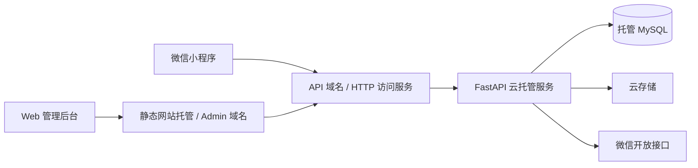

# 小程序 MVP 架构设计（Python 后端版）

版本：v0.3  
日期：2026-03-14

## 1. 文档定位

本文只保留一期 MVP 的核心架构结论、范围边界和实施建议。

详细内容已拆分到子文档：

- [04-1-MVP详细设计-业务数据与接口.md](./04-1-MVP详细设计-业务数据与接口.md)
- [04-2-MVP详细设计-部署与运维.md](./04-2-MVP详细设计-部署与运维.md)

## 2. 一句话结论

一期建议采用：

`微信小程序 + 响应式 Web 管理后台 + FastAPI 单体后端（CloudBase 云托管） + 托管 MySQL + 云存储`

这是面向 MVP 的轻量方案，目标不是“技术上最炫”，而是尽快形成可上线、可维护、后续可扩展的第一版。

## 3. 一期目标与边界

### 包含范围

- 小程序商品展示
- 商品详情留言/咨询
- 店主后台登录与商品管理
- 商品排序、上下架
- 留言查看、标记、回复
- 用户基础访问记录

### 明确不做

- 支付
- 购物车
- 订单系统
- 优惠券
- 复杂会员体系
- 复杂 RBAC
- iPad 原生 App

## 4. 关键设计原则

- 范围收敛：一期只解决展示、内容维护、留言处理三件事。
- 单体优先：不拆微服务，先降低开发和运维成本。
- 媒体解耦：图片放云存储，业务库只存元数据和访问地址。
- 后台优先可运营：优先保证商品维护、留言处理、内容更新链路稳定。
- 贴近正式环境：开发可本地联调，但生产方案直接围绕 CloudBase 云托管展开。

## 5. 总体架构



### 架构说明

- 小程序面向用户，负责商品浏览、详情查看、留言提交。
- Web 后台面向店主，负责商品管理、图片上传、留言处理、店铺配置维护。
- FastAPI 是统一业务后端，同时服务小程序端和后台端。
- MySQL 负责业务数据持久化，云存储负责图片等媒体文件。
- 后台前端构建为静态资源，部署到静态网站托管。

## 6. 核心模块

- 小程序用户：通过 `wx.login()` + 后端换取 `openid`，建立本站登录态。
- 后台账号：一期只保留少量管理员账号，账号密码登录即可。
- 商品管理：商品主信息、分类/标签、排序、上下架。
- 图片管理：后台传图到后端，由后端校验后上传云存储。
- 留言管理：用户留言，店主查看、标记、回复。
- 店铺配置：联系方式、地址、营业时间、介绍文案等基础配置。

详细模块说明见：

- [04-1-MVP详细设计-业务数据与接口.md](./04-1-MVP详细设计-业务数据与接口.md)

## 7. 三条核心流程

### 小程序登录

```text
wx.login() -> 后端 code2Session -> 获取 openid -> 创建/更新用户 -> 签发 access token
```

### 商品发布

```text
后台登录 -> 新建商品 -> 上传图片 -> 云存储落盘 -> 设置排序/封面/上下架 -> 小程序展示
```

### 留言处理

```text
用户提交留言 -> 写入 messages -> 后台显示未读 -> 店主查看/回复 -> 状态更新
```

## 8. 关键技术决策

### 为什么是 FastAPI 单体

- 开发速度快
- 接口定义和校验效率高
- 足够覆盖一期后台和小程序接口
- 后续仍可继续扩展，不会过早被架构复杂度拖慢

### 为什么正式环境用 MySQL

- 比 SQLite 更适合正式上线
- 更容易处理备份、恢复、扩容、多环境隔离
- 更符合后续演进到订单、支付等场景的方向

### 为什么图片走云存储

- 避免依赖容器本地文件系统
- 更适合云托管实例重建、扩缩容和 CDN 接入
- 业务库只保存图片元数据，后续切换存储方案成本更低

## 9. 文档拆分说明

原文中“总体架构、详细设计、部署上线、运维约束、实施顺序”混在同一份文档里，阅读成本偏高。现拆为三层：

- 本文：只保留决策摘要，适合快速对齐方案。
- [04-1-MVP详细设计-业务数据与接口.md](./04-1-MVP详细设计-业务数据与接口.md)：系统分层、模块设计、数据库草案、接口边界、认证设计。
- [04-2-MVP详细设计-部署与运维.md](./04-2-MVP详细设计-部署与运维.md)：部署形态、环境划分、域名备案、安全、可观测性、备份与性能。

## 10. 推荐实施顺序

1. 确认页面清单与后台清单。
2. 确认数据库表结构与接口草案。
3. 初始化小程序、后台 Web、FastAPI 三个工程。
4. 搭建 `dev` 环境，准备 MySQL、云存储和环境变量。
5. 先打通登录、商品列表、商品详情、留言、后台商品管理五条主链路。
6. 再处理图片上传、静态托管、域名接入和上线前验收。

## 11. 最终建议

如果第一版继续使用 Python，这套方案仍然是当前最稳妥的路线：

- 小程序：原生微信小程序
- 管理端：响应式 Web 后台
- 后端：FastAPI 单体
- 数据库：托管 MySQL
- 文件：云存储
- 部署：CloudBase 云托管 + 静态网站托管 + 正式域名

要特别注意的是，改为云托管可以降低运维负担，但不等于自动解决备案、域名和正式环境治理问题。这些事项仍然应提前并行推进。
