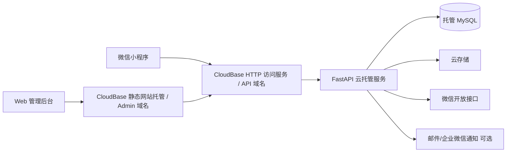
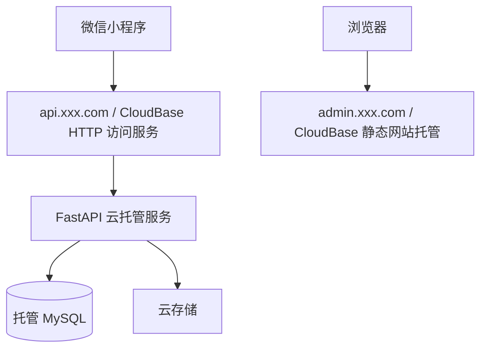

# 小程序 MVP 架构设计（Python 后端版，CloudBase / 云托管适配）

版本：v0.2  
日期：2026-03-14

## 1. 文档目标

本文基于 [02-小程序MVP规划.md](D:\Codes\YRFashion\docs\02-小程序MVP规划.md) 的产品范围，给出第一版可落地的系统架构设计。

本版在不改变业务范围和核心模块设计的前提下，将基础设施方案从“自建服务器部署”调整为“CloudBase / 云托管部署”，以降低运维复杂度，并更贴近最终上线形态。

目标是支撑以下一期能力：

- 微信小程序商品展示
- 商品详情留言/咨询
- 店主 Web 后台登录与商品管理
- 商品排序与上下架
- 留言查看、标记、回复
- 用户基础访问记录

一期明确不包含：

- 支付
- 购物车
- 订单系统
- 优惠券
- 复杂会员体系
- 多角色权限体系
- iPad 原生 App

## 2. 架构结论

第一版建议采用：

`微信小程序 + 响应式 Web 管理后台 + Python FastAPI 单体后端（CloudBase 云托管） + 托管 MySQL + 云存储`

这是一个面向 MVP 的轻量单体架构，不追求过度拆分，重点是：

- 开发快
- 运维简单
- 能适配微信生态内的正式上线流程
- 后续能平滑扩展

## 3. 设计原则

### 3.1 范围收敛

第一版只解决展示、内容维护、留言处理三件事，不提前引入订单、支付、营销等复杂模型。

### 3.2 单体优先

一期不拆微服务。商品、用户、留言、后台账号都放在一个后端服务内，减少开发和运维成本。

### 3.3 媒体与业务解耦

一期图片默认存放在云存储，业务库只保存元数据和访问地址；同时在代码层保留统一文件存储抽象，方便后续切换到其他对象存储或 CDN 方案。

### 3.4 后台优先可运营

留言提醒、商品排序、内容上下架这些运营能力优先做稳定，不把提醒逻辑放在用户侧小程序前台。

### 3.5 为二期预留扩展点

虽然一期不做订单和支付，但数据结构、接口分层和部署方式需要能支撑后续继续演进。

### 3.6 生产方案尽量贴近最终上线形态

开发环境可以先走本地联调，但正式架构设计应直接围绕 CloudBase 云托管、托管数据库、云存储、自定义域名和备案流程展开，避免后期整体返工。

## 4. 总体架构



### 4.1 架构说明

- 微信小程序面向客户，负责商品浏览、详情查看、留言提交。
- Web 管理后台面向店主，负责商品管理、图片上传、留言处理、查看用户记录。
- FastAPI 作为统一业务后端，部署在 CloudBase 云托管中，对外提供小程序接口和后台接口。
- 数据库存放在托管 MySQL 中，避免依赖单机本地持久化。
- 商品图片和静态媒体存放在云存储中，避免依赖容器本地文件系统。
- 管理后台前端构建为静态文件，部署到 CloudBase 静态网站托管。
- 微信开放接口主要用于 `code2Session` 登录态换取。
- 通知能力在一期为可选增强项，默认先做后台未读提醒。

## 5. 技术选型建议

## 5.1 前端

### 小程序端

- 原生微信小程序
- 使用微信开发者工具开发和提审

原因：

- 一期页面不复杂，原生能力足够
- 避免额外跨端框架学习和构建复杂度

### 管理后台

- Vue 3 + Element Plus
- 构建产物部署为静态文件
- 生产环境优先部署到 CloudBase 静态网站托管

原因：

- 适合表单录入、表格管理、图片上传
- 响应式布局后可在 iPad Safari 上直接使用
- 与云托管后端组合后，正式环境部署链路更简单

## 5.2 后端

- Python 3.12
- FastAPI
- SQLAlchemy 2.x
- Alembic
- Pydantic v2
- Uvicorn / Gunicorn
- CloudBase 云托管部署

原因：

- 适合快速验证 MVP
- 接口定义、校验、文档输出效率高
- 后续扩展后台接口和开放接口也足够顺手
- 保留 Python 单体开发体验，同时避免自建 Nginx、进程守护和服务器运维

## 5.3 数据与存储

- 数据库：托管 MySQL
- 文件存储：云存储

说明：

- 本方案默认不采用 CloudBase 原生文档型数据库作为一期生产主库，而采用“CloudBase 云托管 + MySQL”的组合。
- 如果后续决定改走“纯云开发原生能力”路线，再单独输出一版基于文档型数据库的架构设计。
- 一期不再以 SQLite 作为正式生产默认方案，避免依赖单机磁盘和容器本地持久化。
- 当前业务模型虽然简单，但正式上线后仍更适合使用托管 MySQL，以提升备份、扩容和协作稳定性。
- 商品图片不建议保存在云托管容器本地目录，避免实例重建、扩缩容时文件不可控。
- 数据库保存图片 URL、对象路径、文件名、尺寸、排序等元信息。
- 代码层保留文件存储适配器，后续如需切换 COS、CDN 域名或其他对象存储时影响更小。
- 若托管 MySQL 提供自动休眠能力，开发环境可以开启；生产环境应根据首请求时延和后台运营体验决定是否关闭休眠或保留保活策略。

## 5.4 部署

- CloudBase 环境
- CloudBase 云托管承载 FastAPI
- CloudBase 静态网站托管承载管理后台
- HTTP 访问服务 / 自定义域名作为生产访问入口

说明：

- 第一版的重点不再是“买一台 1C2G 服务器”，而是尽快形成可上线、可维护、运维动作更少的正式部署形态。
- 开发联调阶段可以先使用 CloudBase 默认域名或本地联调方案。
- 正式环境如存在浏览器访问后台、公开访问 API 或长期稳定运营诉求，应使用自定义域名和正式证书入口。
- 访问量增长后，优先通过云托管扩容、数据库规格升级和 CDN 优化解决，而不是先拆服务。

## 6. 系统分层设计

后端建议采用标准单体分层，而不是把所有逻辑堆在路由层。

```text
API 层
  - 小程序接口
  - 后台管理接口

应用服务层
  - 登录服务
  - 商品服务
  - 留言服务
  - 用户服务
  - 媒体服务

领域模型层
  - Product
  - ProductImage
  - MiniappUser
  - Message
  - AdminUser
  - Category

基础设施层
  - MySQL 仓储
  - 云存储适配器
  - 微信登录适配器
  - 通知适配器
  - 日志与配置
```

### 6.1 API 层

负责：

- 参数校验
- 权限校验
- 响应结构统一
- 错误码输出

不负责：

- 直接写复杂业务逻辑
- 直接拼接 SQL

### 6.2 应用服务层

负责承接具体用例，例如：

- 小程序登录
- 商品创建与更新
- 商品图片新增与排序
- 留言提交与回复
- 未读留言统计

### 6.3 基础设施层

负责与外部系统交互：

- 托管 MySQL
- 云存储
- 微信 `code2Session`
- 后续通知渠道

这样可以把业务逻辑和第三方 SDK 解耦，后面替换云厂商也更容易。

## 7. 功能模块设计

## 7.1 小程序用户模块

职责：

- 调用 `wx.login()`
- 将 `code` 传给后端
- 后端调用微信接口换取 `openid`
- 建立本站用户记录与登录态

设计建议：

- 以 `openid` 作为小程序用户唯一外部标识
- 不把昵称、头像作为核心强依赖字段
- 首次访问自动建档，后续记录最近访问时间

## 7.2 后台账号模块

职责：

- 店主登录
- 获取后台权限

设计建议：

- 一期只做单管理员或少量后台账号
- 使用账号密码登录
- 密码采用强哈希存储，如 `bcrypt`
- 不做复杂 RBAC，只保留 `admin` 单角色

## 7.3 商品模块

职责：

- 商品新增
- 商品编辑
- 上下架
- 分类/标签维护
- 列表展示
- 排序控制

设计建议：

- 商品主表与商品图片表分离
- 排序字段采用整数 `sort_order`
- 小程序端只返回已上架商品

## 7.4 图片模块

职责：

- 图片上传
- 图片元数据保存
- 封面图指定
- 图片排序

一期实现建议：

- 管理后台把图片先传给后端
- 后端完成文件校验后上传到云存储
- 返回图片访问地址并写入数据库

后续优化建议：

- 文件存储接口保持抽象，后续可切换到其他对象存储或 CDN 域名
- 如果图片量上来，再改造成前端直传云存储 + 后端签发上传凭证

## 7.5 留言模块

职责：

- 用户对商品提交留言
- 店主查看和回复留言
- 未读/已读/已回复状态管理

设计建议：

- 留言与商品强关联
- 一期采用单条留言 + 单次回复模型
- 留言状态流转保持简单：`unread` -> `read` -> `replied`

如果后续要做多轮咨询，再演进为会话模型。

## 7.6 用户记录模块

职责：

- 记录小程序登录用户基础信息
- 记录首次访问与最近访问时间

一期不做：

- 用户画像
- 积分
- 会员等级
- 行为埋点平台

## 7.7 店铺配置模块

职责：

- 联系方式
- 门店地址
- 营业时间
- 店铺介绍
- 首页展示文案

这样首页和联系方式页不需要写死在前端，可以通过后台维护。

## 8. 核心业务流程

## 8.1 小程序登录流程

```text
1. 小程序调用 wx.login() 获取 code
2. 小程序把 code 发送给后端
3. 后端调用微信 code2Session
4. 后端拿到 openid / session_key
5. 若用户不存在则创建用户
6. 后端签发本系统 access token
7. 小程序后续带 token 调用业务接口
```

说明：

- `session_key` 不建议长期暴露给前端
- 后端只保留业务需要的信息

## 8.2 商品发布流程

```text
1. 管理员登录后台
2. 新建商品基本信息
3. 上传商品图片
4. 后端上传图片到云存储并记录图片元数据
5. 设置封面图、排序、上下架状态
6. 小程序商品列表按已上架 + sort_order 展示
```

## 8.3 留言处理流程

```text
1. 用户进入商品详情页
2. 提交留言内容
3. 后端写入 message 表，状态为 unread
4. 后台首页显示未读数
5. 店主查看留言并标记已读或直接回复
6. 回复后状态改为 replied
```

一期不建议把“新留言提醒”放在小程序端，因为处理者是店主，不是普通消费者。

## 9. 数据库设计草案（托管 MySQL 一期版）

以下为一期核心表。

说明：

- 本文中的“表”“索引”“关系”均按 MySQL 关系型数据库来设计，不对应 CloudBase 原生文档型数据库的数据建模方式。
- 业务表结构与原方案基本一致，主要变化是正式生产默认从 SQLite 调整为托管 MySQL。
- 这样可以更自然地接入云托管环境下的备份、恢复、扩容和多环境管理。

## 9.1 `admin_users`

- `id`
- `username`
- `password_hash`
- `display_name`
- `status`
- `last_login_at`
- `created_at`
- `updated_at`

## 9.2 `miniapp_users`

- `id`
- `openid`
- `unionid` 可空
- `nickname` 可空
- `avatar_url` 可空
- `first_visit_at`
- `last_visit_at`
- `created_at`
- `updated_at`

约束建议：

- `openid` 唯一索引

## 9.3 `categories`

- `id`
- `name`
- `sort_order`
- `status`
- `created_at`
- `updated_at`

说明：

- 如果一期分类不复杂，也可以先不单独建表，直接用商品标签字段

## 9.4 `products`

- `id`
- `name`
- `category_id` 可空
- `cover_image_id` 可空
- `description`
- `tags_json`
- `sort_order`
- `status`，如 `draft` / `published` / `archived`
- `created_at`
- `updated_at`

索引建议：

- `status + sort_order`
- `category_id + status + sort_order`

## 9.5 `product_images`

- `id`
- `product_id`
- `storage_type`，一期固定为 `cloud`
- `storage_path`
- `image_url`
- `original_name`
- `width` 可空
- `height` 可空
- `sort_order`
- `is_cover`
- `created_at`

说明：

- `storage_path` 表示云存储中的对象路径或 Key
- `image_url` 可对应云存储访问域名、CDN 域名或媒体访问域名

## 9.6 `messages`

- `id`
- `product_id`
- `miniapp_user_id`
- `content`
- `status`
- `reply_content` 可空
- `reply_at` 可空
- `read_at` 可空
- `created_at`
- `updated_at`

索引建议：

- `product_id + created_at`
- `status + created_at`
- `miniapp_user_id + created_at`

## 9.7 `shop_settings`

- `id`
- `shop_name`
- `shop_intro`
- `contact_phone`
- `wechat_id`
- `address`
- `business_hours`
- `homepage_banner_json`
- `updated_at`

## 10. 接口边界设计

建议按调用方拆分接口前缀，避免混用。

## 10.1 小程序接口

前缀建议：`/api/miniapp`

示例：

- `POST /api/miniapp/auth/login`
- `GET /api/miniapp/home`
- `GET /api/miniapp/products`
- `GET /api/miniapp/products/{id}`
- `POST /api/miniapp/products/{id}/messages`
- `GET /api/miniapp/shop/contact`

## 10.2 后台接口

前缀建议：`/api/admin`

示例：

- `POST /api/admin/auth/login`
- `GET /api/admin/dashboard/summary`
- `GET /api/admin/products`
- `POST /api/admin/products`
- `PUT /api/admin/products/{id}`
- `POST /api/admin/products/{id}/images`
- `PUT /api/admin/products/{id}/sort`
- `GET /api/admin/messages`
- `POST /api/admin/messages/{id}/read`
- `POST /api/admin/messages/{id}/reply`
- `GET /api/admin/users`
- `GET /api/admin/settings`
- `PUT /api/admin/settings`

## 11. 认证与权限设计

## 11.1 小程序端认证

建议采用：

- 登录换取本站 JWT access token
- token 有效期较短
- 必要时增加 refresh token

一期也可以先采用单 token 方案，控制实现复杂度。

## 11.2 后台认证

建议采用：

- 后台账号密码登录
- 返回后台 access token
- 管理接口统一鉴权

一期权限建议：

- 单角色 `admin`

后续如果要加店员协同，再扩展角色和资源权限。

## 12. 部署架构设计

## 12.1 推荐部署形态



部署建议：

- `admin.xxx.com` 指向 CloudBase 静态网站托管中的后台 Web。
- `api.xxx.com` 指向 CloudBase HTTP 访问服务，再转发到 FastAPI 云托管服务。
- 小程序把 `api.xxx.com` 配成正式业务请求域名。
- 商品图片通过云存储访问域名或 CDN 域名暴露，不再走容器本地路径。

补充说明：

- 开发和测试阶段可以先使用平台默认域名或临时联调方案。
- 生产环境如需要浏览器直接访问后台或公共 API，建议统一使用自定义域名。
- 平台默认域名更适合测试验证，不建议作为正式长期入口。

## 12.2 云环境与服务建议

一期可采用：

- 1 个 `prod` CloudBase 环境
- 1 个 FastAPI 云托管服务
- 1 个后台静态网站托管站点
- 1 个托管 MySQL 实例
- 1 个云存储桶

如果预算更紧：

- `dev` 环境可以复用较低规格配置
- 云托管实例最小实例数可先从 `0` 起步，接受一定冷启动
- 非核心环境数据库可采用更低规格

如果更重视稳定性：

- 生产环境可为 FastAPI 服务保留最小实例数
- 生产数据库避免自动休眠影响首请求时延
- 图片访问接入 CDN 或媒体加速域名

## 12.3 环境划分

至少保留两个环境：

- `dev`：开发联调
- `prod`：正式环境

如果人手允许，增加：

- `staging`：提审前验收环境

建议做法：

- 不同环境使用独立环境变量、数据库、存储前缀或桶
- 小程序、后台前端和后端服务的环境配置统一管理
- 不要让开发环境直接共用生产数据库和生产存储路径

## 12.4 域名与备案

正式上线前要把“小程序备案”和“自定义域名备案”拆开看。

建议明确以下判断：

- 使用 CloudBase / 云托管，不等于免除小程序备案。
- 如果存在正式 Web 管理后台、H5 页面或浏览器直接访问的 API，自定义域名仍建议尽早准备并完成 ICP 备案。
- 小程序侧如果只调用微信云能力，理论上可以减少对单独业务域名的依赖；但本项目包含后台 Web，生产环境仍建议准备 `admin.xxx.com` 和 `api.xxx.com` 两个正式域名。
- 备案不建议拖到最后，应与账号注册、主体资料准备、环境搭建并行推进。

## 12.5 上线入口建议

建议将正式上线入口拆分为：

- 小程序正式版：调用已配置的正式 API 域名
- 后台 Web：通过备案后的正式域名访问
- 图片资源：通过云存储访问域名或 CDN 域名访问

这样可以避免后期从默认域名、临时地址或本地联调地址切换到正式域名时带来大规模返工。

## 13. 非功能设计

## 13.1 安全

- 全站 HTTPS
- 后台强密码策略
- 图片上传校验 MIME、大小、后缀
- 文件名使用 UUID，避免覆盖和路径穿透
- 留言内容长度限制与敏感词过滤预留
- 接口限流，重点保护登录和留言提交接口
- 微信密钥、数据库连接、存储凭证等敏感配置使用环境变量或平台密钥管理
- 管理后台域名与 API 域名做好跨域、鉴权和来源控制

## 13.2 可观测性

- 应用日志分访问日志和错误日志
- 为每个请求生成 `request_id`
- 记录关键后台操作日志：商品编辑、上下架、回复留言
- 接入 CloudBase 平台日志、监控指标和告警能力

## 13.3 备份

- 托管 MySQL 开启自动备份、快照或定期导出
- 云存储开启生命周期管理，必要时保留历史版本或异地备份
- 重要配置支持导出
- 关键后台数据可定期导出为审计或恢复用途

## 13.4 性能

一期目标不是高并发，但仍建议：

- 商品列表接口分页
- 首页、商品列表可做短时缓存
- 图片使用压缩图和缩略图
- 图片访问优先通过云存储访问域名或 CDN 返回
- 如冷启动影响明显，可提高云托管最小实例数或增加保活策略

## 14. 一期与二期的演进路径

当前架构可以平滑演进到二期，主要扩展方向如下：

### 二期可新增模块

- 收藏/预约
- 订阅通知
- 营销活动
- 订单
- 支付

### 架构演进原则

- 先保持单体应用，继续扩表扩接口
- 当消息通知、订单支付明显复杂后，再考虑拆独立模块
- Redis、任务队列、搜索服务都应在明确需要时再引入

## 15. 当前推荐实施顺序

1. 先确认页面清单和后台清单
2. 基于本文输出面向 MySQL 的数据库表结构草案
3. 输出接口设计草案
4. 初始化三个工程：小程序端、后台 Web、FastAPI 后端
5. 搭建 CloudBase `dev` 环境，准备托管 MySQL、云存储和基础环境变量
6. 先打通登录、商品列表、商品详情、留言、后台商品管理五条主链路
7. 再处理图片上传、后台静态托管、域名接入和环境配置
8. 并行推进小程序备案、域名备案和正式发布前验收

## 16. 最终建议

如果你第一版准备继续使用 Python，建议按下面这条路线执行：

- 小程序端：原生微信小程序
- 管理端：响应式 Web 后台，部署到 CloudBase 静态网站托管
- 后端：FastAPI 单体应用，部署到 CloudBase 云托管
- 数据库：托管 MySQL
- 文件：云存储
- 部署：CloudBase 环境 + HTTP 访问服务 + 自定义域名

这套方案对当前 MVP 是更合适的，因为它保留了 Python/FastAPI 的开发效率，同时把正式环境的运维复杂度从“自己管服务器和本地持久化”切换为“以平台托管为主”。需要特别注意的是，改用云开发/云托管可以减少服务器运维负担，但不等于完全免除小程序备案或自定义域名备案；这两件事仍应提前纳入上线计划。
